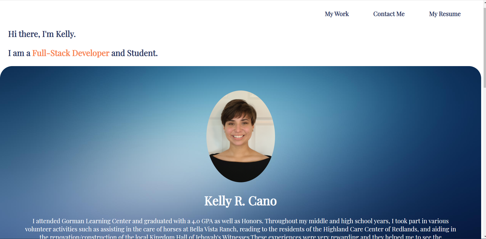

# My-Portfolio

## Description
This project is the updated version of my portfolio. My original portfolio used basic HTML and CSS but with this updated version I cleaned up the layout and changed up the color scheme. I also added current work examples and their GitHub repositories to my portfolio instead of the placeholders that were originally there. I also added icons for the ways to contact me or view my work through Github, LinkedIn, Gmail, and phone call. I also added a 'My Skills' section to highlight what I have learned throughout the course. In addition to updating my portfolio I have also been able to update my Github and linkedIn account with my most current information.

## Usage
I have included a few features from my original portfolio like the navigation bar that scrolls to the corresponding spot on the page accroding to the link you presss, the images in the 'My Work' section allow you to go to the live site according to the project you click and same with the Repsoitory links. The 'My Resume' link in the navigation bar takes the viewer to a downloadable PDF version of my current resume. Lastly, I added links with icons that direct the viewer straight to how to contact me with just a click of a button.

[livesite](https://krcano.github.io/My-Portfolio/)

## Technologies

| Technologies Used | 
| ------------------| 
| JavaScript        |
| HTML              | 
| CSS               |
## License

## MIT License

Copyright (c) [2021] [Kelly R. Cano]

Permission is hereby granted, free of charge, to any person obtaining a copy
of this software and associated documentation files (the "Software"), to deal
in the Software without restriction, including without limitation the rights
to use, copy, modify, merge, publish, distribute, sublicense, and/or sell
copies of the Software, and to permit persons to whom the Software is
furnished to do so, subject to the following conditions:

The above copyright notice and this permission notice shall be included in all
copies or substantial portions of the Software.

THE SOFTWARE IS PROVIDED "AS IS", WITHOUT WARRANTY OF ANY KIND, EXPRESS OR
IMPLIED, INCLUDING BUT NOT LIMITED TO THE WARRANTIES OF MERCHANTABILITY,
FITNESS FOR A PARTICULAR PURPOSE AND NONINFRINGEMENT. IN NO EVENT SHALL THE
AUTHORS OR COPYRIGHT HOLDERS BE LIABLE FOR ANY CLAIM, DAMAGES OR OTHER
LIABILITY, WHETHER IN AN ACTION OF CONTRACT, TORT OR OTHERWISE, ARISING FROM,
OUT OF OR IN CONNECTION WITH THE SOFTWARE OR THE USE OR OTHER DEALINGS IN THE
SOFTWARE.
